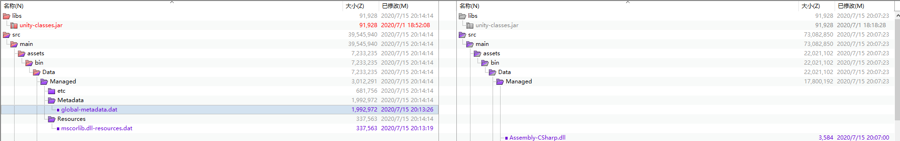
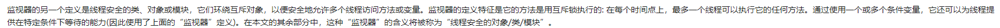

# 2020.07.15IL2CPP源码阅读
[https://www.nevermoe.com/2016/08/10/unity-metadata-loader/](https://www.nevermoe.com/2016/08/10/unity-metadata-loader/)
[https://floe-ice.cn/archives/55](https://floe-ice.cn/archives/55)
## 一个简单的介绍
[https://www.jianshu.com/p/7cfcb7b0cfe7](https://www.jianshu.com/p/7cfcb7b0cfe7)

## 什么是global-metadata.dat

```c++
MetadataAlloc.h

```


## IL2CPPClass
```c++
typedef struct Il2CppClass
{
    // The following fields are always valid for a Il2CppClass structure
    const Il2CppImage* image;
    void* gc_desc;
    const char* name;
    const char* namespaze;
    Il2CppType byval_arg;
    Il2CppType this_arg;
    Il2CppClass* element_class;
    Il2CppClass* castClass;
    Il2CppClass* declaringType;
    Il2CppClass* parent;
    Il2CppGenericClass *generic_class;
    const Il2CppTypeDefinition* typeDefinition; // non-NULL for Il2CppClass's constructed from type defintions
    const Il2CppInteropData* interopData;
    Il2CppClass* klass; // hack to pretend we are a MonoVTable. Points to ourself
    // End always valid fields

    // The following fields need initialized before access. This can be done per field or as an aggregate via a call to Class::Init
    FieldInfo* fields; // Initialized in SetupFields
    const EventInfo* events; // Initialized in SetupEvents
    const PropertyInfo* properties; // Initialized in SetupProperties
    const MethodInfo** methods; // Initialized in SetupMethods
    Il2CppClass** nestedTypes; // Initialized in SetupNestedTypes
    Il2CppClass** implementedInterfaces; // Initialized in SetupInterfaces
    Il2CppRuntimeInterfaceOffsetPair* interfaceOffsets; // Initialized in Init
    void* static_fields; // Initialized in Init
    const Il2CppRGCTXData* rgctx_data; // Initialized in Init
    // used for fast parent checks
    Il2CppClass** typeHierarchy; // Initialized in SetupTypeHierachy
    // End initialization required fields

    uint32_t initializationExceptionGCHandle;

    uint32_t cctor_started;
    uint32_t cctor_finished;
    ALIGN_TYPE(8) uint64_t cctor_thread;

    // Remaining fields are always valid except where noted
    GenericContainerIndex genericContainerIndex;
    uint32_t instance_size;
    uint32_t actualSize;
    uint32_t element_size;
    int32_t native_size;
    uint32_t static_fields_size;
    uint32_t thread_static_fields_size;
    int32_t thread_static_fields_offset;
    uint32_t flags;
    uint32_t token;

    uint16_t method_count; // lazily calculated for arrays, i.e. when rank > 0
    uint16_t property_count;
    uint16_t field_count;
    uint16_t event_count;
    uint16_t nested_type_count;
    uint16_t vtable_count; // lazily calculated for arrays, i.e. when rank > 0
    uint16_t interfaces_count;
    uint16_t interface_offsets_count; // lazily calculated for arrays, i.e. when rank > 0

    uint8_t typeHierarchyDepth; // Initialized in SetupTypeHierachy
    uint8_t genericRecursionDepth;
    uint8_t rank;
    uint8_t minimumAlignment; // Alignment of this type
    uint8_t naturalAligment; // Alignment of this type without accounting for packing
    uint8_t packingSize;

    // this is critical for performance of Class::InitFromCodegen. Equals to initialized && !has_initialization_error at all times.
    // Use Class::UpdateInitializedAndNoError to update
    uint8_t initialized_and_no_error : 1;

    uint8_t valuetype : 1;
    uint8_t initialized : 1;
    uint8_t enumtype : 1;
    uint8_t is_generic : 1;
    uint8_t has_references : 1;
    uint8_t init_pending : 1;
    uint8_t size_inited : 1;
    uint8_t has_finalize : 1;
    uint8_t has_cctor : 1;
    uint8_t is_blittable : 1;
    uint8_t is_import_or_windows_runtime : 1;
    uint8_t is_vtable_initialized : 1;
    uint8_t has_initialization_error : 1;
    VirtualInvokeData vtable[IL2CPP_ZERO_LEN_ARRAY];
} Il2CppClass;
```
## IL2CPPObject
```c++
typedef struct Il2CppObject
{
    union
    {
        Il2CppClass *klass;
        Il2CppVTable *vtable;
    };
    MonitorData *monitor;
} Il2CppObject;
```

## Monitor

