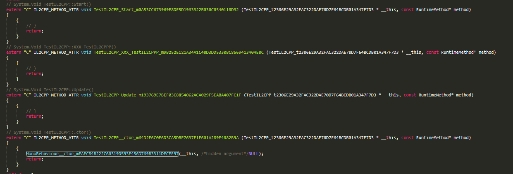
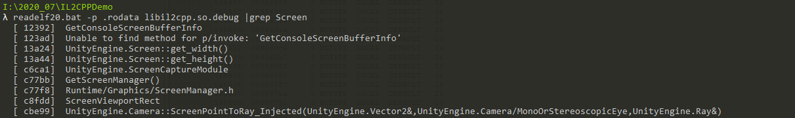

# 2020.07.20IL2CPP_代码翻译

[https://jacksondunstan.com/articles/5251](https://jacksondunstan.com/articles/5251)

## 测试代码

## 翻译代码
被翻译后的代码放在了tmp目录下


## IL2CPP如何调用Unity的接口的?
```c++
// System.Int32 UnityEngine.Screen::get_width()
extern "C" IL2CPP_METHOD_ATTR int32_t Screen_get_width_m8ECCEF7FF17395D1237BC0193D7A6640A3FEEAD3 (const RuntimeMethod* method)
{
	typedef int32_t (*Screen_get_width_m8ECCEF7FF17395D1237BC0193D7A6640A3FEEAD3_ftn) ();
	static Screen_get_width_m8ECCEF7FF17395D1237BC0193D7A6640A3FEEAD3_ftn _il2cpp_icall_func;
	if (!_il2cpp_icall_func)
	_il2cpp_icall_func = (Screen_get_width_m8ECCEF7FF17395D1237BC0193D7A6640A3FEEAD3_ftn)il2cpp_codegen_resolve_icall ("UnityEngine.Screen::get_width()");
	int32_t retVal = _il2cpp_icall_func();
	return retVal;
}

// System.Int32 UnityEngine.Screen::get_height()
extern "C" IL2CPP_METHOD_ATTR int32_t Screen_get_height_mF5B64EBC4CDE0EAAA5713C1452ED2CE475F25150 (const RuntimeMethod* method)
{
	typedef int32_t (*Screen_get_height_mF5B64EBC4CDE0EAAA5713C1452ED2CE475F25150_ftn) ();
	static Screen_get_height_mF5B64EBC4CDE0EAAA5713C1452ED2CE475F25150_ftn _il2cpp_icall_func;
	if (!_il2cpp_icall_func)
	_il2cpp_icall_func = (Screen_get_height_mF5B64EBC4CDE0EAAA5713C1452ED2CE475F25150_ftn)il2cpp_codegen_resolve_icall ("UnityEngine.Screen::get_height()");
	int32_t retVal = _il2cpp_icall_func();
	return retVal;
}
```

## 核心实现如下
通过这个接口获取函数指针然后进行调用.
il2cpp_codegen_resolve_icall("UnityEngine.Screen::get_width()");


[https://www.one-tab.com/page/TsVdyIgHQfm2r2MpHHdWaQ](https://www.one-tab.com/page/TsVdyIgHQfm2r2MpHHdWaQ)

## 导出函数有对应的字符串,结果应该会被加密
readelf -p .rodata


## 结构体是怎么样的呢?


[https://www.jacksondunstan.com/articles/4533](https://www.jacksondunstan.com/articles/4533)
