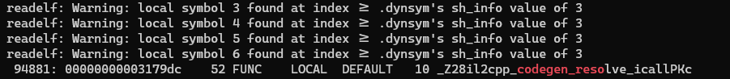

# 2020.11.05IL2CPP_DUMPER

## 一种dump思路

[https://www.unknowncheats.me/forum/unity/422949-findanyobject-il2cpp.html](https://www.unknowncheats.me/forum/unity/422949-findanyobject-il2cpp.html)

[https://github.com/wh0am15533](https://github.com/wh0am15533)


## 获取角色位置坐标


##  怎么获取内存函数

```shell
λ readelf20.bat -s libil2cpp.dbg.so |rg il2cpp_codegen_reso
 94877: 00000000002dd9b8    52 FUNC    LOCAL  DEFAULT   10 _Z28il2cpp_codegen_resolv
106768: 00000000002ddcb4     4 FUNC    LOCAL  DEFAULT   10 _Z22il2cpp_codegen_resolv
```

_Z28il2cpp_codegen_resolv 未被导出,需要使用base加偏移获取



## il2cpp怎么调用unity函数
```c#
unity_resolve_icall = (il2cpp_codegen_resolve_icall)((uint8_t*)libbase + 0x2dd9b8);
if(unity_resolve_icall)
{
	LOGI("find unity_resolve_icall succeed %p", unity_resolve_icall);
	unity_find_objects = (t_unity_find_objects)unity_resolve_icall(fname_find_gameobjects);
	if(unity_find_objects)
	{
	 	LOGI("resolve_icall unity_find_objects soucceed");
	}

	unity_get_transform = (t_unity_get_transform)unity_resolve_icall(fname_get_transform);
	if(unity_get_transform)
	{
		LOGI("resolve_icall unity_get_transform succeed");
	}

	unity_get_main_camera = (t_unity_get_main_camera)unity_resolve_icall(fname_get_current_camera);
	if(unity_get_main_camera)
	{
		LOGI("resolve_icall unity_get_main_camera succeed");
	}

	unity_transform_get_vector = (t_unity_transform_get_vector)unity_resolve_icall(fname_get_transform_vector);
	if(unity_transform_get_vector)
	{
		LOGI("resolve_icall unity_transform_get_vector succceed");
	}
}
else 
{
	LOGE("find unity_resolve_icall failed");
}
```

##  使用il2cpp获取角色位置信息

