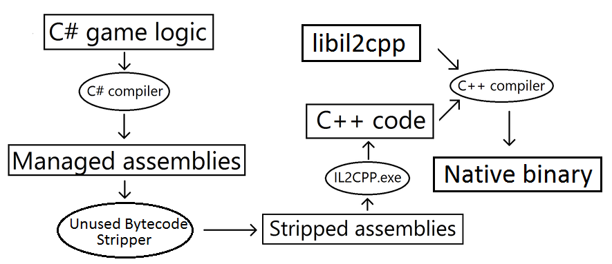
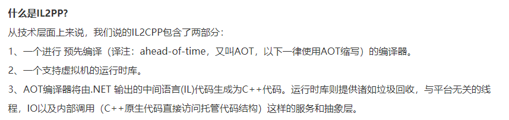

# 2020.11.15IL2CPP_原理解析

## IL2CPP的运行原理

## IL2CPP内存转换
为啥需要内存转换？
　　既然IL2CPP已经把C#代码都变成了C++代码，我们干嘛还需要从C#做内存转换到C++？虽然生成的C++代码是原生代码，但是在某些情况下，C#中数据类型的呈现还是和C++有所区别的，因此IL2CPP在运行的时候必须在两边来回转换。il2cpp.exe对数据类型和方法都会做相同的转换操作。
　　在托管代码层面，所有的数据类型都被分为两类：blittable或者non-blittable。blittable类型意味着在托管和原生代码中，内存的表现是一致的，没有区别（比如：byte，int，float）。Non-blittable类型在两者中的内存表现就不一致。（比如：bool，string，array）。正因为这样，blittable类型数据能够直接传递给原生代码，但是non-blittable类型就需要做转换工作了。**而这个转换工作很自然的就牵扯到新内存的分配**。
　　为了告诉托管编译器某些函数是在原生代码中实现的，我们需要使用“extern”关键字。使用这个关键字，和“DllImport”属性相配合，使得托管的运行时库能够找到原生中的函数并且调用他们。il2cpp.exe会为每一个extern函数产生一个封装。这层封装执行了以下一些很重要的任务：
　　为原生代码生成一个typedef以用来通过函数指针进行函数调用。通过名字找到原生代码中的函数，并且将其赋值给一个函数指针如果有必要，将托管代码中的参数内存转换到原生代码格式

## 什么是IL2CPP

