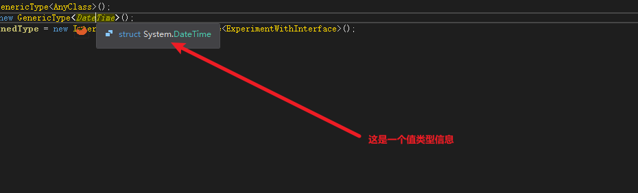

# 2020.12.07_IL2CPP_泛型共享

## 目标

减小Code尺寸大小

IL2CPP起初并不支持泛型共享，我们到最近的改进版中才使得泛型共享机制足够的健壮并能使其带来好处。既然il2cpp.exe产生C++代码，我们可以分析这些代码来了解泛型共享机制是如何实现的。

我们将探索对于引用类型或者值类型而言，泛型函数在何种情况下会进行泛型共享，而在何种情况下不会。我们也会讨论泛型参数是如何影响到泛型共享机制的.

请记住，所有以下的讨论都是细节上的实现。这里的讨论和所涉及的代码很有可能在未来发生改变。只要有可能，我们都会对这些细节进行探讨。

## 什么是泛型共享

    思考一下如果你在C#中写一个List<T>的实现。这个List的实现会根据T的类型不同而不同么？对于List的Add函数而言，List<string>和List<object>会是一样的代码么？那如果是List<DateTime>呢？

    实际上，泛型的强大之处在于这些C#的实现都是共享的，List泛型类可以适用于任何的T类型。但是当C#代码转换成可执行代码，比如Mono的汇编代码或者由IL2CPP产生的C++代码的时候会发生什么呢？我们能在这两个层面上也实现Add函数的代码共享么？

    答案是肯定的，我们能在大多数的情况下做到共享。正如本文后面将要讨论的：泛型函数的泛型共享与否主要取决于这个T的大小如何。如果T是任何的引用类型（像string或者是object），那T的尺寸永远是一个指针的大小。如果T是一个值类型（比如int或者DateTime），大小会不一样，情况也会相对复杂。代码能共享的越多，那么最终可执行文件的尺寸就越小。

## IL2CPP的共享是啥样子的？

就目前而言， 当SomeGenericType中的T是下面的情况时，IL2CPP会对泛型函数进行泛型共享：

１、任何引用类型（例如：string，object，或者用户自定义的类）
２、任何整数或者是枚举类型 

当T是其他值类型的时候，IL2PP是不会进行泛型共享的。因为这个时候类型的大小会很不一样。 
实际的情况是，对于新加入使用的SomeGenericType，如果T是引用类型，那么它对于最终的可执行代码的尺寸几乎是没有影响的。然而，如果新加入的T是直类型，那就会影响到尺寸。这个逻辑对于Mono和IL2CPP都适用。如果你想知道的更多，请继续往下读，到了说实现细节的时候了！


## 项目设置

```c#
public void DemonstrateGenericSharing() {
    var usesAString = new GenericType<string>();
    var usesAClass = new GenericType<AnyClass>();
    var usesAValueType = new GenericType<DateTime>();
    var interfaceConstrainedType = new InterfaceConstrainedGenericType<ExperimentWithInterface>();
}
```

```C#
class GenericType<T> {
public T UsesGenericParameter(T value) {
return value;
}

public void DoesNotUseGenericParameter() {}

public U UsesDifferentGenericParameter<U>(U value) {
return value;
}
}

class AnyClass {}

interface AnswerFinderInterface {
int ComputeAnswer();
}

class ExperimentWithInterface : AnswerFinderInterface {
public int ComputeAnswer() {
return 42;
}
}

class InterfaceConstrainedGenericType<T> where T : AnswerFinderInterface {
public int FindTheAnswer(T experiment) {
return experiment.ComputeAnswer();
}
}
```

## 对应生成的代码
```c++
// T GenericType`1<System.Object>::UsesGenericParameter(T)
IL2CPP_EXTERN_C IL2CPP_METHOD_ATTR RuntimeObject * GenericType_1_UsesGenericParameter_m0F34477E646608588E920530062F3052B0DD68B3_gshared (GenericType_1_t0C98402A658D6ED54303ED35FF5E55864132C153 * __this, RuntimeObject * ___value0, const RuntimeMethod* method)
{
	{
		// return value;
		RuntimeObject * L_0 = ___value0;
		return L_0;
	}
}
```

在两处使用泛型参数T的地方（分别在返回值和函数参数中），C++代码都使用了Object_t*。因为任何引用类型都能在C++代码中被Object_t*所表示，所以我们也就能够对于任何引用T，调用相同的UsesGenericParameter函数。


C++代码其实是把返回值（Object_t*类型）强制转换成了AnyClass_t1*类型。因此在这里IL2CPP对C++编译器使了个障眼法。因为C#的编译器会保证UsesGenericParameter中的T是可兼容的类型，因此IL2CPP这里的强转是安全的。


## 带泛型约束的共享

假设如果我们想要让T能够调用一些特定的函数。因为System.Object只有最基本的一些函数而不存在你想要使用的任何其他函数，那么在C++中使用Object_t*就会造成障碍了，不是嘛？是的，你说的没错！但是我们有必要在此解释一下C#编译器中的泛型约束的概念。

让我们再仔细看看InterfaceConstrainedGenericType的C#代码。这个泛型类型使用了一个‘where’关键字以确保T都是从一个特定的接口（Interface）：AnswerFinderInterface继承过来的。这就使得调用ComputeAnswer 函数成为可能。大家还记得上一篇博文中我们讨论的吗：当调用一个接口函数的时候，我们需要在虚表（vtable structure）中进行查找。因为FindTheAnswer可以从约束类型T中被直接调用，所以C++代码依然能够使用全共享的实现机制，也就是说T由Object_t*所代表。


因为IL2CPP把所有的C#中的接口（Interface）都当作System.Object一样处理，其所产生的C++代码也就能说得通了。这个规则在C++代码的其他情况中也同样适用。


## 基类的约束
除了对接口（Interface）进行约束，C#还允许对基类进行约束。IL2CPP并不是把所有的基类都当成System.Object处理。那么对于有基类约束的泛型共享又是怎样的呢？ 

因为基类肯定都是引用类型，所以IL2CPP还是使用全共享版本的泛型函数来处理这些受约束的类型。任何有用到约束类型中特定成员变量或者成员函数的地方都会被C++代码进行强制类型转换。再次强调，在这里我们仰仗C#编译器强制检查这些约束类型都符合转换要求，我们就可以放心的蒙蔽C++编译器了。

## 值类型的泛型共享

让我们回到HelloWorld_DemonstrateGenericSharing_m4函数看下 GenericType的实现。DateTime是个值类型，因此GenericType不会被共享。我们可以看看这个类型的构造函数GenericType_1__ctor_m10。这个函数是GenericType所特有的，不会被其他类使用。

## 原始C#代码
```c#
var usesAValueType = new GenericType<DateTime>();
```

## 翻译后的代码
```c++
// var usesAValueType = new GenericType<DateTime>();
GenericType_1_tAF3F7910D4AA1CEAB5E401E07AF3F3879EFCFE9C * L_2 = (GenericType_1_tAF3F7910D4AA1CEAB5E401E07AF3F3879EFCFE9C *)il2cpp_codegen_object_new(GenericType_1_tAF3F7910D4AA1CEAB5E401E07AF3F3879EFCFE9C_il2cpp_TypeInfo_var);

GenericType_1__ctor_m7F4BF3547167101EB99B933ED93032F3F56A87AD(L_2, /*hidden argument*/GenericType_1__ctor_m7F4BF3547167101EB99B933ED93032F3F56A87AD_RuntimeMethod_var);
```





```c++
// 类型信息
// GenericType`1<System.DateTime>
struct  GenericType_1_tAF3F7910D4AA1CEAB5E401E07AF3F3879EFCFE9C  : public RuntimeObject
{
public:

public:
};

// New一个对象
// var usesAValueType = new GenericType<DateTime>();
GenericType_1_tAF3F7910D4AA1CEAB5E401E07AF3F3879EFCFE9C * L_0 = (GenericType_1_tAF3F7910D4AA1CEAB5E401E07AF3F3879EFCFE9C *)il2cpp_codegen_object_new(GenericType_1_tAF3F7910D4AA1CEAB5E401E07AF3F3879EFCFE9C_il2cpp_TypeInfo_var);

// 什么是TypeInfo_var，就是一个RuntimeClass的指针
IL2CPP_EXTERN_C RuntimeClass* GenericType_1_tAF3F7910D4AA1CEAB5E401E07AF3F3879EFCFE9C_il2cpp_TypeInfo_var;

// 调用构造函数GenericType_1__ctor_m7F4BF3547167101EB99B933ED93032F3F56A87AD
GenericType_1__ctor_m7F4BF3547167101EB99B933ED93032F3F56A87AD(L_0, /*hidden argument*/GenericType_1__ctor_m7F4BF3547167101EB99B933ED93032F3F56A87AD_RuntimeMethod_var);

// 构建函数是什么样子的?
// System.Void GenericType`1<System.DateTime>::.ctor()
inline void GenericType_1__ctor_m7F4BF3547167101EB99B933ED93032F3F56A87AD (GenericType_1_tAF3F7910D4AA1CEAB5E401E07AF3F3879EFCFE9C * __this, const RuntimeMethod* method)
{
	((  void (*) (GenericType_1_tAF3F7910D4AA1CEAB5E401E07AF3F3879EFCFE9C *, const RuntimeMethod*))GenericType_1__ctor_m7F4BF3547167101EB99B933ED93032F3F56A87AD_gshared)(__this, method);
}
// 其实就是调用了GenericType_1__ctor_m7F4BF3547167101EB99B933ED93032F3F56A87AD_gshared然后强制转换

// 那么什么是GenericType_1__ctor_m7F4BF3547167101EB99B933ED93032F3F56A87AD_gshared

// System.Void GenericType`1<System.DateTime>::.ctor()
IL2CPP_EXTERN_C IL2CPP_METHOD_ATTR void GenericType_1__ctor_m7F4BF3547167101EB99B933ED93032F3F56A87AD_gshared (GenericType_1_tAF3F7910D4AA1CEAB5E401E07AF3F3879EFCFE9C * __this, const RuntimeMethod* method)
{
	{
		NullCheck((RuntimeObject *)__this);
		Object__ctor_m925ECA5E85CA100E3FB86A4F9E15C120E9A184C0((RuntimeObject *)__this, /*hidden argument*/NULL);
		return;
	}
}
// 其实就是调用了Object的构造函数


```

## 泛型函数的共享


## 结论

泛型共享是自IL2CPP发布以来一个最重要的改进。通过共享相同的代码实现，它使得C++代码尽可能的小。我们也会继续利用共享代码机制来进步一减少最终二进制文件的尺寸。

在下一篇文章中，我们将探讨 p/invoke 封装代码是如何产生的。以及托管代码中的类型数据是如何转换到原生代码（C++代码）中的。我们将检视各种类型转换所需要的开销，并且尝试调试有问题的数据转换代码。
