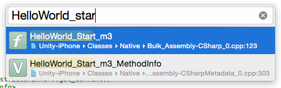
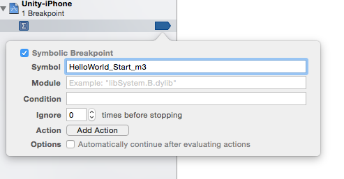
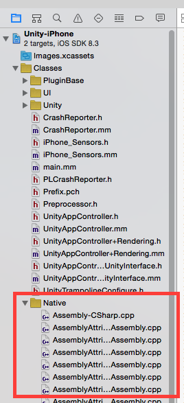
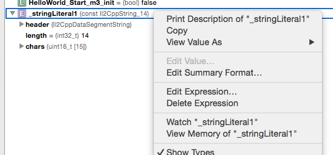
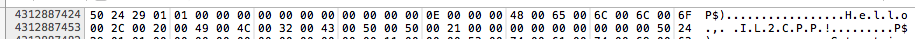
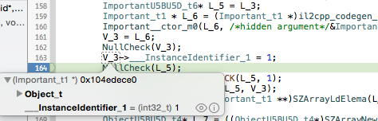
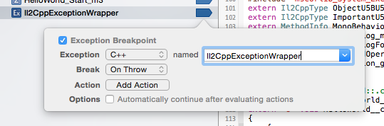
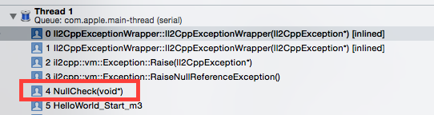
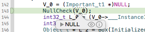

# 2020.12.07_IL2CPP_调试技巧

在本文中，我们将探究一些代码调试技巧，一些可以使IL2CPP生成的C++代码调试更加容易的技巧。
我们将了解如何设定断点、查看字符串和用户定义类型的内容、以及如何确定出现异常的位置。

当我们接触到这些内容时，应该正在调试由.NETIL代码创建的生成C++代码，因此调试过程有可能不那么令人满意。但是通过一些调试技巧，便有可能透彻的理解Unity项目代码如何在实际目标设备上执行（我们会在文章的末尾讨论一些有关调试托管代码的内容）。

同时，在项目中为生成代码做准备，以便其区别于该代码。通过Unity各个新版本，我们正在寻找一个方法使生成代码更好、更快、更小短。

## 设置
在本文中，我在OSX系统上使用Unity 5.0.1p3。使用和有关生成代码的文章中相同的示例项目，但是此次使用IL2CPP脚本后端为iOS目标建立示例项目。如上篇文章所述，在选择“Development Player”的情况下建立项目，这样il2cpp.exe便会生成C++代码，且生成的类型名称和方法名称以IL代码中的名称为基础。

Unity生成Xcode项目完成后，在Xcode中将其打开（我的版本为6.3.1，任何更新版本都可使用），选择目标设备（iPad Mini 3，任何iOS设备都可使用）并在Xcode中建立项目。

## 设定断点
运行项目之前，首先在HelloWorld中Start的顶部设定断点。正如前一篇文章中所见，在生成的C++代码中该方法名称为HelloWorld_Start_m3。我们可以使用Cmd+Shift+O并键入该方法名称，以便在Xcode中查找，然后在此处设定断点。




我们也可在Xcode中选择Debug > Breakpoints > CreateSymbolic Breakpoint，然后，用此方法设定断点。



现在当我运行Xcode项目时，可以立刻看到在该方法开始的时候中断。

如果我们知道方法名称，则可在此类生成代码中用其他方法设定断点。在Xcode中，也可在生成代码的某个文件的具体行设定断点。实际上所有的生成文件都是Xcode项目的一部分。你可以在Classes/Native文件夹的Project Navigator中看到这些文件。



## 查看字符串

在Xcode中有两种方法可查看IL2CPP字符串的表示法。我们可以直接查看字符串存储器，或者调用libil2cpp中某个字符串的处理程序，将字符串转化成Xcode可以显示的std::string。查看名为 _stringLiteral1字符串的值（剧透：内容为“Hello, IL2CPP!”）。


在带内嵌Ctags的生成代码（或在Xcode中使用Cmd+Ctrl+J）中，我们可以跳转至_stringLiteral1的定义并发现其类型为Il2CppString_14：

```c++
struct Il2CppString_14
{
  Il2CppDataSegmentString header;
  int32_t length;
  uint16_t chars[15];
};
```

实际上，IL2CPP中所有字符串都如此显示。我们可以在object-internals.h头文件中找到Il2CppString的定义。在IL2CPP中，这些字符串包括任何托管类型的标头部分，Il2CppObject（通过Il2CppDataSegmentString定义类型访问）后是4字节长度，然后是双字节字符数组。编译时定义的字符串，如 _stringLiteral1，以定长chars数组结束，但是执行时产生的字符串具有分配的数组。字符串中的字符编码为UTF-16。


如果我们添加 _stringLiteral1到Xcode的监视窗口，我们可选择View Memory of “_stringLiteral1”选项，以便查看存储器中字符串的布局。



然后在存储器查看器中，我们可以看到以下内容：



字符串的头成员为16字节，因此将其跳过后，我们会发现四字节的值为0x000E (14)。该范围后的下一个字节为字符串0x0048 (‘H’) 的首位字符。因为每个字符为两字节宽度，但是该字符串中所有字符仅匹配一个字节宽度，所以在Xcode右侧显示这些字符且各字符中间以圆点隔开。字符串内容仍清晰可见。该字符串查看方法确实有效，但难于查看更加复杂的字符串。

在Xcode中我们也可通过lldb命令提示符查看字符串内容。在使用libil2cpp时，utils/StringUtils.h数据头会提供接口处理一些字符串程序。特别是通过lldb命令提示符调用Utf16ToUtf8的方法。其界面如下所示：

```c++
static std::string Utf16ToUtf8 (const uint16_t* utf16String);
```

我们可以把C++里的字符串内容转变成这种方式，将返回一个UTF-8编码的std::string。然后，如果在lldb命令提示符中使用p命令，则可以打印字符串内容。

```c++
(lldb) p il2cpp::utils::StringUtils::Utf16ToUtf8(_stringLiteral1.chars)
(std::__1::string) $1 = "Hello, IL2CPP!"
```

## Viewing user defined types

我们在XCode可以查看自定义数据类型,里面有一个比较重要的信息就是InstanceIdentifier.




## 生成代码中异常中断

我自己经常调试生成代码且试图跟踪错误原因。在许多情况下这些错误都以托管异常的方式出现。正如上一篇文章中讨论的，IL2CPP使用C++异常执行托管异常，所以在Xcode中出现托管异常时我们可以用一些方法进行中断。

出现托管异常时最简单的中断方法就是在il2cpp_codegen_raise_exception函数上设定一个中断点，il2cpp.exe利用此中断点在任何明显出现托管异常的位置进行中断。



接下来，如果运行项目，Xcode将在Start代码中出现InvalidOperationException异常时中断。此位置查看字符串内容非常有效。如果深入研究exargument组成，则可发现其包含一个___message_2，这是一个表示异常信息的字符串。

```c#
Important boom = null;
Debug.Log(boom.InstanceIdentifier);
```





## 结论
　　由IL2CPP生成的C++代码可能会出现问题，在讨论了调试生成代码的一些技巧后，我希望大家更好的明白如何发现处理此类问题。我鼓励大家研究IL2CPP使用的其他类型布局，以便学习更多有关如何调试生成代码的知识。

　　可是IL2CPP托管代码调试器在哪里？难道我们不能在设备上通过IL2CPP脚本后端调试托管代码运行吗？实际是可以的。现在我们拥有一个达到阿尔法质量标准的内部IL2CPP托管代码调试器。虽然尚未发布但是已列入我们产品发布路线图，敬请关注。 

　　托管代码中会出现各种方法调用类型，本系列下一篇文章将探讨IL2CPP脚本后端执行调用类型的不同方式。我们将密切关注各个方法调用类型的运行成本