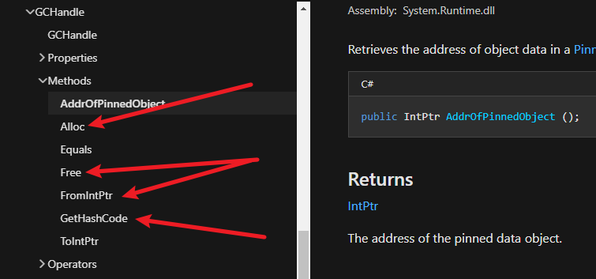

# 2020.12.10_IL2CPP_GC

在本文中，我们将探讨一下 IL2CPP 运行时如何与垃圾收集器集成。具体来说，我们将了解托管代码中的 GC 根是如何与本机垃圾收集器通信的

## Garbage collection

我不会在这篇文章中讨论一般的垃圾收集技术，因为它是一个广泛而多样的主题，包含了大量现有的研究和已发表的信息。接下来，就把 GC 想象成一个开发对象引用有向图的算法。如果对象 Parent 使用了一个对象 Child (通过本机代码中的一个指针) ，那么图表如下所示:


当 GC 在内存中搜索进程时，它会查找没有父进程的对象。如果它找到了一个，那么它就可以在其他东西上重用这个对象的内存。

当然，大多数对象都有某种类型的父对象，因此 GC 确实需要知道哪些对象是重要的父对象。我喜欢把它们看作是程序实际使用的对象。在 GC 术语中，这些被称为“根”。下面是一个没有根的父类的例子。


在这种情况下，Parent 2没有根，因此 GC 可以重用 Parent 2和 Child 2中的内存。但是，Parent 1和 Child 1有一个根，因此 GC 不能重用它们的内存。这个程序仍然在使用它们做一些事情。

对于.NET，有三种根:

* Local variables on the stack of any thread executing managed code
* Static variables
* GCHandle objects

我们将看到 IL2CPP 如何与垃圾收集器就这三种类型的根进行通信。

## The setup

```c#
using System;
using System.Runtime.InteropServices;
using System.Threading;
using UnityEngine;

public class AnyClass {}

public class HelloWorld : MonoBehaviour {
    private static AnyClass staticAnyClass = new AnyClass();
        void Start () {
            var thread = new Thread(AnotherThread);
            thread.Start();
            thread.Join();
            var anyClassForGCHandle = new AnyClass();
            var gcHandle = GCHandle.Alloc(anyClassForGCHandle);
        }

        private static void AnotherThread() {
            var anyClassLocal = new AnyClass();
        }
}
```

## Static variables

但是有些变量并不依赖于线程调用堆栈。这些是静态变量，它们也需要由垃圾收集器作为根来处理。

当 IL2CPP 布局一个类的本机表示时，它将所有的静态字段组合在一个不同的 c + + 结构中，这个结构来自类中的实例字段。在 Xcode，我们可以跳到 HelloWorld t 2类的定义:

```c++
//HelloWorld003
struct  HelloWorld003_t0F90959F3D61CC6F06771E020AC1ADC3ED86EF6B  : public MonoBehaviour_t4A60845CF505405AF8BE8C61CC07F75CADEF6429
{
public:

public:
};

struct HelloWorld003_t0F90959F3D61CC6F06771E020AC1ADC3ED86EF6B_StaticFields
{
public:
	// AnyClass HelloWorld003::staticAnyClass
	AnyClass_t3884B49B1D437A8EB2356588A28B4A1FB6EBC5EA * ___staticAnyClass_4;

public:
	inline static int32_t get_offset_of_staticAnyClass_4() { return static_cast<int32_t>(offsetof(HelloWorld003_t0F90959F3D61CC6F06771E020AC1ADC3ED86EF6B_StaticFields, ___staticAnyClass_4)); }
	inline AnyClass_t3884B49B1D437A8EB2356588A28B4A1FB6EBC5EA * get_staticAnyClass_4() const { return ___staticAnyClass_4; }
	inline AnyClass_t3884B49B1D437A8EB2356588A28B4A1FB6EBC5EA ** get_address_of_staticAnyClass_4() { return &___staticAnyClass_4; }
	inline void set_staticAnyClass_4(AnyClass_t3884B49B1D437A8EB2356588A28B4A1FB6EBC5EA * value)
	{
		___staticAnyClass_4 = value;
		Il2CppCodeGenWriteBarrier((&___staticAnyClass_4), value);
	}
};

// System.Void HelloWorld003::.cctor()
extern "C" IL2CPP_METHOD_ATTR void HelloWorld003__cctor_m5C1C3A66D35BE461D3074AAFC2DA8DB24F82D875 (const RuntimeMethod* method)
{
	static bool s_Il2CppMethodInitialized;
	if (!s_Il2CppMethodInitialized)
	{
		il2cpp_codegen_initialize_method (HelloWorld003__cctor_m5C1C3A66D35BE461D3074AAFC2DA8DB24F82D875_MetadataUsageId);
		s_Il2CppMethodInitialized = true;
	}
	{
	    // new一个对象
		// private static AnyClass staticAnyClass = new AnyClass();
		AnyClass_t3884B49B1D437A8EB2356588A28B4A1FB6EBC5EA * L_0 = (AnyClass_t3884B49B1D437A8EB2356588A28B4A1FB6EBC5EA *)il2cpp_codegen_object_new(AnyClass_t3884B49B1D437A8EB2356588A28B4A1FB6EBC5EA_il2cpp_TypeInfo_var);

		// 调用构造函数
		AnyClass__ctor_m47DF24613D7CC29665DA1F047021DF7492B5D53D(L_0, /*hidden argument*/NULL);

        //il2cpp_codegen_static_fields_for
	   ((HelloWorld003_t0F90959F3D61CC6F06771E020AC1ADC3ED86EF6B_StaticFields*)il2cpp_codegen_static_fields_for(HelloWorld003_t0F90959F3D61CC6F06771E020AC1ADC3ED86EF6B_il2cpp_TypeInfo_var))->set_staticAnyClass_4(L_0);
		return;
	}
}

// 里面有个核心函数是调用klass的static_fields
inline void* il2cpp_codegen_static_fields_for(RuntimeClass* klass)
{
    return klass->static_fields;
}
```

请注意，IL2CPP 没有使用 c + + static 关键字，因为它需要控制静态字段的布局和分配，以便正确地与 GC 通信。在运行时首次使用类型时，libil2cpp 代码将初始化该类型。这个初始化的一部分涉及为 HelloWorld _ t2 _ staticfields 结构分配内存。这个内存是通过对 GC: il2cpp_GC_alloc_fixed (也在 GC-internal.h 文件中)的特殊调用来分配的。


## GCHandle objects



假设您不想使用静态变量，但是您仍然希望在允许垃圾收集器为对象重用内存时进行更多的控制。当您需要将指向托管对象的指针从托管代码传递到本机代码时，这通常很有帮助。如果本机代码将获得该对象的所有权，那么我们需要告诉垃圾收集器，本机代码现在是其对象图中的一个根。这是通过使用一个名为 GCHandle 的特殊托管对象实现的。

GCHandle 的创建通知运行时代码，给定的托管对象应该被视为 GC 中的根，这样它和它引用的任何对象都不会被重用。在 IL2CPP 中，我们可以在 contents/frameworks/IL2CPP/libil2cpp/gc/gchandle.h 文件中看到实现这一点的底层 API。同样，这不是一个公共 API，但是调查起来很有趣。让我们在 GCHandle: : New 函数上设置一个断点。如果我们继续这个项目，我们应该看到这个调用栈:


注意，为我们的 Start 方法生成的代码调用 GCHandle _ alloc _ m11，它最终创建一个 GCHandle 并通知垃圾收集器我们有一个新的根对象。

## Conclusion

我们查看了一些内部 API 方法，以了解 IL2CPP 运行时如何与垃圾收集器交互，从而让它知道哪些对象是它应该保留的根。注意，我们根本没有讨论过 IL2CPP 使用哪个垃圾收集器。它目前使用的是 Boehm-Demers-Weiser GC，但我们已经努力将垃圾收集器隔离在一个干净的接口之后。我们目前计划研究开源 corecr 垃圾收集器的集成。我们还没有这种集成的确切发布日期，但请关注我们的公共路线图以获得更新。

像往常一样，我们只是触及了 IL2CPP 中 GC 集成的皮毛。我鼓励您进一步探索 IL2CPP 和 GC 如何相互作用。也请分享你的见解。

下一次，我们将通过了解如何测试 IL2CPP 代码来总结 IL2CPP 内部构件系列。